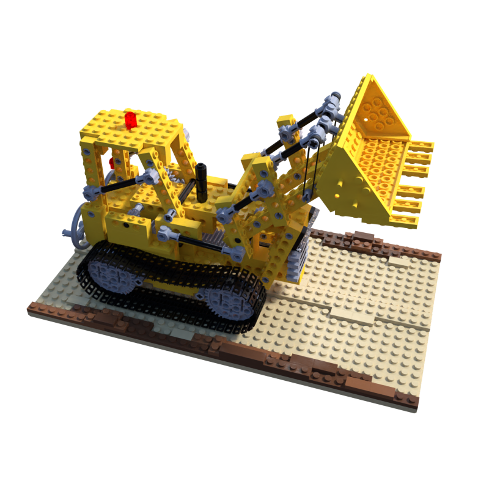
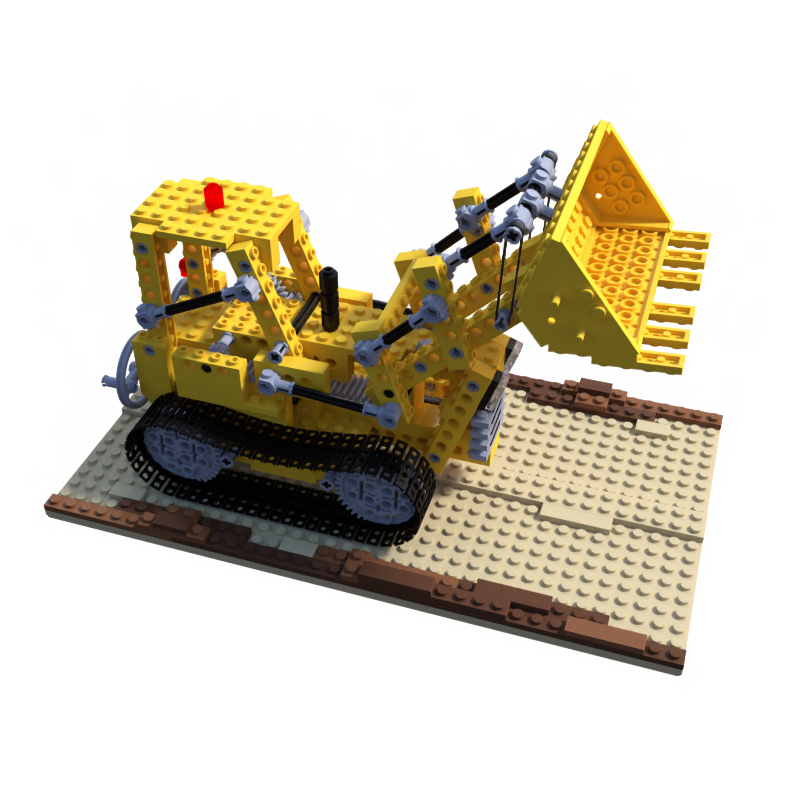

# TensorRF Pytorch Lightning

This is a fork of [TensorRF](https://github.com/apchenstu/TensoRF), reimplemented in [Pytorch Lightning](https://lightning.ai/docs/pytorch/stable/).
With this implementation, we achieve beter modulization and faster training. 

Create a conda environment using `environment.yml`. It's tested on cuda 11.7 and corresponding torch version. 

To train

```
python launch.py --config ./configs/lego.txt --train
```

To run testing
```
python launch.py --config /path/to/saved/config.txt --test --resume /path/to/ckpt
```

## Structure

The original structure is decomposed to:
- Density field
- Radiance field
- Occupancy grid
- A renderer that implements the rendering algorithm 

This decomposition makes modules reusable and could be furthur used for other applications 
such as inverse rendering.

## Results

| G.T. | Original | This repo |
| ---- | -------- | --------- |
|  |  |  |

For lego scene, on a single RTX 2080, with batch size 4096 and 30000 iters

|  | time | psnr |
|---|---|---|
| Original | 25:30 | 35.51 |
| PL | 22:14 | 35.53 |

Other metrics(LPIPS, SSIM) are similar to valus reported in original paper. 

